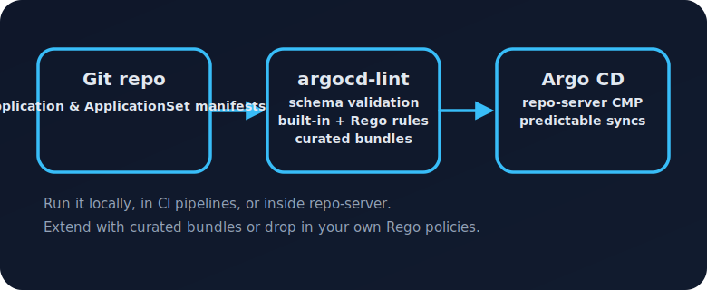
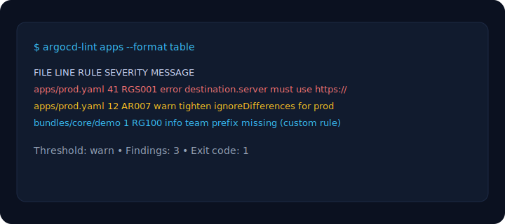

# argocd-lint

[![CI]](https://github.com/argocd-lint/argocd-lint/actions/workflows/ci.yaml)
[![Release]](https://github.com/argocd-lint/argocd-lint/actions/workflows/release.yaml)
[](LICENSE)


> Fast, offline-first linting for Argo CD `Application` and `ApplicationSet` manifests.
>
> - Catch schema and policy drift before it reaches the cluster.
> - Wire the same guardrails into CI, pre-commit, or Argo CD repo-server.
> - Extend the rulebook with curated or custom Rego plugins.



## At a glance

| Task | Command or resource |
| --- | --- |
| Install the latest release | `go install github.com/argocd-lint/argocd-lint/cmd/argocd-lint@latest` |
| Run a quick lint with warnings as failures | `argocd-lint ./apps --severity-threshold=warn` |
| Package curated plugin bundles | `./scripts/package-plugin-bundles.sh dist` |
| Integrate with Argo CD repo-server | [`docs/REPO_SERVER.md`](docs/REPO_SERVER.md) |

## Contents

- [Features](#features)
- [Installation](#installation)
- [Quick start](#quick-start)
- [Configuration](#configuration)
  - [Optional rendering](#optional-rendering)
  - [Policy plugins](#policy-plugins)
  - [API validation (dry-run)](#api-validation-dry-run)
- [Output formats](#output-formats)
- [Shipped rules](#shipped-rules)
- [Integrations](#integrations)
- [Development](#development)

## Features

- **Schema aware** – validates manifests against the Argo CD CRDs without needing a cluster.
- **Rule engine** – ships with opinionated best-practice checks and per-rule severity overrides.
- **Flexible output** – table (interactive), JSON (automation), and SARIF (GitHub Code Scanning).
- **Optional rendering** – Helm/Kustomize rendering and findings via `--render`.
- **Policy plugins** – load custom Rego rules or curated bundles with `--plugin` / `--plugin-dir`.
- **Integrations** – ready-to-use pre-commit hook, CI workflows, and SARIF upload recipe.
- **Single binary** – no runtime dependencies; ideal for Git hooks and build agents.
- **Version-aware validation** – pin CRD schemas to an Argo CD release via `--argocd-version`.

### Why platform teams ship it

- **Predictable syncs** – block risky manifests before Argo CD applies them.
- **Shared guardrails** – reuse the same policy bundles locally, in CI, and in repo-server.
- **Fast feedback loop** – sub-second linting for typical app directories.
- **Batteries included** – curated bundles plus a plugin API for everything else.

## Installation

Choose the method that best fits your workflow:

- **Download a release** (Linux/macOS/Windows, amd64/arm64) from [GitHub Releases](https://github.com/argocd-lint/argocd-lint/releases) and place the binary on your `$PATH`.
- **Build from source**:
  ```bash
  git clone https://github.com/argocd-lint/argocd-lint.git
  cd argocd-lint
  go build -o bin/argocd-lint ./cmd/argocd-lint
  ```
- **Use Go install** (requires Go 1.22+):
  ```bash
  go install github.com/argocd-lint/argocd-lint/cmd/argocd-lint@latest
  ```

Verify the installation:

```bash
argocd-lint --version
```

## Quick start

Pick the workflow that matches your day-to-day routine:

- **Code review gate** – `argocd-lint ./apps --severity-threshold=warn`
- **ApplicationSet only** – `argocd-lint ./clusters --apps=false --appsets`
- **Render and lint Helm charts** –
  ```bash
  argocd-lint ./clusters \
    --render \
    --helm-binary=$(which helm)
  ```
- **Embed in repo-server** – follow [`examples/repo-server-plugin`](examples/repo-server-plugin/README.md)



## Configuration

Fine-tune rules with a YAML file:

```yaml
rules:
  AR001:
    severity: error      # escalate floating targetRevision to error
  AR006:
    enabled: false       # disable finalizer guidance globally

severityThreshold: warn  # default threshold for exit code (overridden by CLI flag)

overrides:
  - pattern: "environments/prod/**"
    rules:
      AR007:
        severity: error  # tighten ignoreDifferences in production
```

Apply the configuration via `--rules`:

```bash
argocd-lint ./manifests --rules rules.yaml --format json
```

### Optional rendering

Use local Helm/Kustomize sources when linting:

```bash
argocd-lint ./apps \
  --render \
  --helm-binary=/opt/homebrew/bin/helm \
  --kustomize-binary=/opt/homebrew/bin/kustomize \
  --repo-root=$(pwd)
```

Rendering failures surface as `RENDER_HELM` or `RENDER_KUSTOMIZE` findings and respect your rule overrides.

### Schema pinning

Match validation to the Argo CD control-plane version:

```bash
argocd-lint ./apps --argocd-version=v2.8
```

If omitted, the latest bundled CRDs are used.

### Policy plugins

Load Rego policies to extend the built-in rule set:

```bash
argocd-lint ./apps \
  --plugin examples/plugins/require-prefix.rego \
  --plugin-dir ./custom-policies
```

Each plugin exports metadata (rule id, default severity, category) and a `deny` rule that returns findings. See [docs/PLUGINS.md](docs/PLUGINS.md) for the schema and authoring guide.

> Tip: curated bundles live in `bundles/`. Package them for air-gapped
> environments with `./scripts/package-plugin-bundles.sh` and mount them into CI
> runners or repo-server sidecars.

#### Bundle catalogue

- **Core** – consistent naming and ownership labels (`bundles/core/`).
- **Security** – HTTPS destinations and secure Git transport (`bundles/security/`).

### API validation (dry-run)

Use kubeconform or the Kubernetes API server to validate rendered resources:

```bash
argocd-lint ./apps --render --dry-run=kubeconform

argocd-lint ./apps \
  --render \
  --dry-run=server \
  --kubeconfig=$HOME/.kube/config \
  --kube-context=prod
```

Dry-run failures surface as `DRYRUN_KUBECONFORM` or `DRYRUN_SERVER` findings.

### Repo-server integration

Run the exact same lint checks during Argo CD syncs:

1. Build the repo-server image in `examples/repo-server-plugin/` so the container
   includes `argocd-lint` and your preferred bundles.
2. Register the Config Management Plugin by patching `argocd-cmp-cm` with
   `plugin.yaml`.
3. Point applications at the plugin via `spec.source.plugin.name: argocd-lint` and
   (optionally) tune parameters like the severity threshold.

Full instructions live in [`docs/REPO_SERVER.md`](docs/REPO_SERVER.md).

### Output formats

- `table` (default) – human-readable summary.
- `json` – machine-friendly format for scripting.
- `sarif` – upload to GitHub Code Scanning.

## Shipped rules

| ID | Kind(s) | Default | Category | Summary |
| --- | --- | --- | --- | --- |
| AR001 | Application, ApplicationSet | warn | Delivery | `targetRevision` must be pinned (no floating refs). |
| AR002 | Application, ApplicationSet | error | Governance | `spec.project` must not be empty or `default`. |
| AR003 | Application | error | Safety | Namespace destinations must declare `destination.namespace`. |
| AR004 | Application | warn | Operations | `syncPolicy` should explicitly choose automated/manual. |
| AR005 | Application | warn | Operations | Automated sync should enable `prune` and `selfHeal`. |
| AR006 | Application | info | Safety | Finalizer usage should be intentional. |
| AR007 | Application | warn | Drift | `ignoreDifferences` must remain tightly scoped. |
| AR008 | ApplicationSet | warn | Delivery | Enable `missingkey=error` for Go templates. |
| AR009 | Application | error | Delivery | Source definitions must be consistent (`path` vs `chart`). |
| AR010 | Application, ApplicationSet | info | Observability | Recommend `app.kubernetes.io/name` label. |
| AR011 | Application | error | Consistency | Application names must be unique within a lint run. |
| SCHEMA_APPLICATION | Application | error | Compliance | Built-in CRD schema validation. |
| SCHEMA_APPLICATIONSET | ApplicationSet | error | Compliance | Built-in CRD schema validation. |
| RENDER_HELM | Application, ApplicationSet | error | Render | `helm template` must succeed (`--render`). |
| RENDER_KUSTOMIZE | Application, ApplicationSet | error | Render | `kustomize build` must succeed (`--render`). |
| DRYRUN_KUBECONFORM | Application, ApplicationSet | error | Validation | `kubeconform` must accept the rendered manifest (`--dry-run=kubeconform`). |
| DRYRUN_SERVER | Application, ApplicationSet | error | Validation | `kubectl --dry-run=server` must accept the manifest (`--dry-run=server`). |

## Integrations

### Pre-commit

```yaml
repos:
  - repo: local
    hooks:
      - id: argocd-lint
        name: argocd-lint
        entry: argocd-lint --severity-threshold=warn
        language: system
        pass_filenames: false
```

### GitHub Actions

End-to-end example:

```yaml
name: Lint Argo CD manifests

on: [pull_request]

jobs:
  lint:
    runs-on: ubuntu-latest
    steps:
      - uses: actions/checkout@v4
      - uses: actions/setup-go@v5
        with:
          go-version: '1.22'
      - run: go install github.com/argocd-lint/argocd-lint/cmd/argocd-lint@latest
      - run: argocd-lint apps --format sarif > argocd-lint.sarif
      - uses: github/codeql-action/upload-sarif@v3
        with:
          sarif_file: argocd-lint.sarif
```

The repository also ships reusable workflows in `.github/workflows/` for CI and release automation.

## Development

```bash
make build     # compile binary into ./bin
make test      # go test ./...
make check     # gofmt check + go test
make release   # cross-compile into ./dist
```

Helpful references:

- [CONTRIBUTING.md](CONTRIBUTING.md) – development workflow and expectations.
- [AGENT.md](AGENT.md) – guardrails for automation.
- [CHANGELOG.md](CHANGELOG.md) – release notes history.
- [docs/RELEASING.md](docs/RELEASING.md) – maintainer release guide.
- [docs/PLUGINS.md](docs/PLUGINS.md) – roadmap for custom policy plug-ins.
- Releases are automated: every merge to `main` triggers release-please to prepare a draft; tags (`v*`) build cross-platform binaries and publish to GitHub Releases.
- Container image is published to GHCR (`ghcr.io/<org>/argocd-lint`) alongside each tagged release.

## Community & support

- Questions or ideas? Open a [feature request](.github/ISSUE_TEMPLATE/feature_request.md).
- Found a bug? File a [bug report](.github/ISSUE_TEMPLATE/bug_report.md) with reproduction steps.
- Contributions are welcome—see [CONTRIBUTING.md](CONTRIBUTING.md) and abide by the [Code of Conduct](CODE_OF_CONDUCT.md).

## License

Apache License 2.0 – see [LICENSE](LICENSE).
