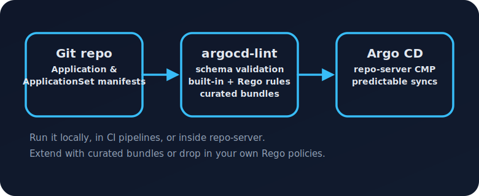

# argocd-lint

[![CI]](https://github.com/argocd-lint/argocd-lint/actions/workflows/ci.yaml)
[![Release]](https://github.com/argocd-lint/argocd-lint/actions/workflows/release.yaml)
[](LICENSE)


> Fast, offline-first linting for Argo CD `Application`, `ApplicationSet`, and `AppProject` resources.
>
> - 🧭 Catch schema drift and risky sync plans before Argo CD does.
> - 🧰 Ship a single binary that renders, lint, dry-runs, and previews ApplicationSets.
> - 🧩 Extend the rulebook with curated or custom Rego bundles.



## Quick links

| Action | Command / Resource |
| --- | --- |
| Install latest version | `go install github.com/argocd-lint/argocd-lint/cmd/argocd-lint@latest` |
| Lint an environment | `argocd-lint ./apps --severity-threshold=warn` |
| Preview ApplicationSet drift | `argocd-lint applicationset plan --file appset.yaml` |
| List bundled policies | `argocd-lint plugins list` |
| Package curated bundles | `./scripts/package-plugin-bundles.sh dist` |
| Repo-server integration guide | [`docs/REPO_SERVER.md`](docs/REPO_SERVER.md) |

## Contents

1. [Highlights](#highlights)
2. [Install](#install)
3. [Get started in 30 seconds](#get-started-in-30-seconds)
4. [CLI tour](#cli-tour)
5. [Configuration & policies](#configuration--policies)
6. [ApplicationSet drift preview](#applicationset-drift-preview)
7. [Outputs & integrations](#outputs--integrations)
8. [Contributing & roadmap](#contributing--roadmap)
9. [License](#license)

## Highlights

- **Schema aware** – embedded CRDs keep lint checks fast and offline.
- **Opinionated rules** – curated best practices cover revisions, destinations, labels, and multi-source pitfalls.
- **Extensible** – plug in Rego modules, discover their metadata, and curate bundles for teams.
- **Render & validate** – optional Helm/Kustomize rendering plus kubeconform/server dry-run modes.
- **Fast feedback** – parallel lint workers and optional render caching keep mono-repos snappy.
- **Single binary** – formatted tables, JSON, and SARIF outputs with zero runtime dependencies.

## Install

| Method | Command |
| --- | --- |
| Go toolchain (1.22+) | `go install github.com/argocd-lint/argocd-lint/cmd/argocd-lint@latest` |
| Build from source | ```bash
git clone https://github.com/argocd-lint/argocd-lint.git
cd argocd-lint
go build -o bin/argocd-lint ./cmd/argocd-lint
``` |
| Release binaries | Download from [GitHub Releases](https://github.com/argocd-lint/argocd-lint/releases) and drop on your `$PATH`. |

Verify the CLI:

```bash
argocd-lint --version
```

## Get started in 30 seconds

1. Lint a repo with warnings treated as failures:

   ```bash
   argocd-lint ./manifests --severity-threshold=warn
   ```

2. Render Helm charts before linting:

   ```bash
   argocd-lint ./clusters \
     --render \
     --helm-binary=$(which helm)
   ```

3. Preview ApplicationSet drift:

   ```bash
   argocd-lint applicationset plan --file appset.yaml
   ```

4. Surface curated bundle metadata:

   ```bash
   argocd-lint plugins list --dir bundles/core
   ```


## CLI tour

| Command | What it does |
| --- | --- |
| `argocd-lint <path>` | Lint Applications, ApplicationSets, and AppProjects in a directory or file. |
| `--format table|json|sarif` | Choose human-readable tables or automation-friendly formats. |
| `--render` | Render Helm/Kustomize sources before linting. |
| `--dry-run=kubeconform|server` | Validate rendered resources using kubeconform or the API server. |
| `--argocd-version v2.8` | Pin schema validation to a specific Argo CD release. |
| `--render-cache` | Cache successful render results to avoid re-running Helm/Kustomize on identical sources. |
| `--max-parallel N` | Set the maximum number of concurrent lint workers (default = CPU count). |
| `plugins list` | Discover rule metadata (id, severity, applies-to, source) for curated/community bundles. |
| `applicationset plan` | Preview generated Applications and drift (create/delete/unchanged) without hitting the API server. |

### Sample plan output

```
$ argocd-lint applicationset plan --file appset.yaml
+--------+---------+----------------------------+---------------------------------------------+
| Action | Name    | Destination                | Source                                      |
+--------+---------+----------------------------+---------------------------------------------+
| CREATE | app-one | apps | https://example.com | https://example.com/repo.git | apps/app-one |
| CREATE | app-two | apps | https://example.com | https://example.com/repo.git | apps/app-two |
+--------+---------+----------------------------+---------------------------------------------+

Total: 2  create=2  delete=0  unchanged=0
```

## Configuration & policies

Fine-tune rules via YAML:

```yaml
rules:
  AR001:
    severity: error
  AR006:
    enabled: false

severityThreshold: warn

overrides:
  - pattern: "environments/prod/**"
    rules:
      AR007:
        severity: error
```

Apply the config:

```bash
argocd-lint ./manifests --rules rules.yaml --format json
```

### Policy bundles & plugins

- Load custom Rego policies: `argocd-lint ./apps --plugin-dir ./custom-policies`.
- Discover curated metadata: `argocd-lint plugins list --dir bundles/core`.
- Authoring guide & community checklist: [docs/PLUGINS.md](docs/PLUGINS.md).
- Bundles live under `bundles/` (core, security, plus community submissions).

## ApplicationSet drift preview

`applicationset plan` expands list generators with Go templates + sprig helpers, renders the
Application template for each element, and compares the resulting names with Applications on disk
(via `--current` or the working tree). Use it in CI to show exactly which Applications would be
created, deleted, or left unchanged during the next sync. See [docs/APPLICATIONSET_PLAN.md](docs/APPLICATIONSET_PLAN.md)
for deeper examples.

## Outputs & integrations

- **Formats** – `table` (default), `json`, and `sarif` for GitHub Advanced Security.
- **Dry-run** – kubeconform or API server validation with `--dry-run=kubeconform|server`.
- **Repo-server** – reuse lint guardrails inside Argo CD using the Config Management Plugin ([examples/repo-server-plugin](examples/repo-server-plugin/README.md)).
- **CI / Git hooks** – the static binary drops straight into pipelines and pre-commit hooks.

## Contributing & roadmap

- Roadmap & recently shipped items: [docs/ROADMAP.md](docs/ROADMAP.md).
- Release process: [docs/RELEASING.md](docs/RELEASING.md).
- Plugin contribution checklist: [docs/PLUGINS.md](docs/PLUGINS.md#community-bundle-submissions).
- Before opening a PR, run the validation suite:

  ```bash
  go test ./...
  gofmt -w $(find . -name '*.go' -not -path './vendor/*')
  ```

## License

Licensed under the [Apache 2.0 License](LICENSE).

[CI]: https://img.shields.io/github/actions/workflow/status/argocd-lint/argocd-lint/ci.yaml?branch=main&label=CI
[Release]: https://img.shields.io/github/actions/workflow/status/argocd-lint/argocd-lint/release.yaml?label=release
